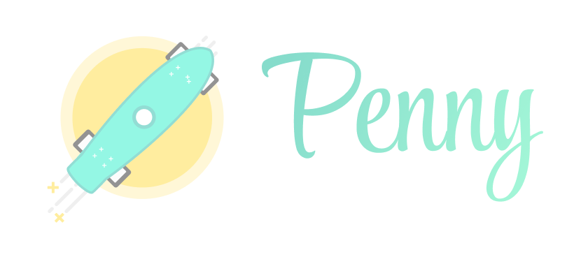

# Penny Design System v0.0.1



[Latest version](https://main--624aecefae45c1003a80bf5b.chromatic.com/)

## Components for Ripio React apps

### Table of Contents

- [Install & integration](#install-and-integration)
- [Run storybook in dev](#run-storybook-in-dev)
- [Methodologies](#methodologies)
  - [Atomic Design](#atomic-design)
  - [Molecules definition](#molecules-definition)
  - [Organism definition](#organism-definition)
- [Components Library Creation Guide](#components-library-creation-guide)

## Install and integration

1. Install: `npm i penny-ds --save`
2. Import styles in your index.js: `import 'penny-ds/index.css'`
3. Add provider before router:
	```
	import { DesignSystemProvider } from 'penny-ds'
	const App = () =>
		<DesignSystemProvider>
	    <Router>
	    ...
	    </Router>
	  </DesignSystemProvider>
	export default App
	```
4. Import components!
	```
	import { Button } from 'penny-ds'
	const MyComp = () =>
		<Button id="my_id">
	    My button!
	  </Button>
	export default MyComp
	```

## Run storybook in dev

Follow these steps to `start the project` in development

1. Clone repository. `git clone git@git.in.ripio.com:ripio_public/penny-ds.git`
2. Install dependencies in the project folder. `npm install`.
3. If there's some problems with dependencis, run `npx sb update`
3. Run Storybook `npm run start`, this command run Storybook and build tokens. This comman run 2 task `npm run tokens` and ` npm run storybook`

Check the `package.json` file, there you will find the commands necessary for the development

## Run test

1. Run `npm run test`

---

## Methodologies

### Atomic Design

For this project will be using the methodology to create componentes called [Atomic Design](https://shop.bradfrost.com/products/atomic-design-ebook). The component library will be creating just **Atoms** and **Molecules** with the following definitions:

#### Atoms definition

For this project an atom will be a component that is composed by an unique Atom with or without HTML tags, or just HTML tags.

#### Molecules definition

For this project a molecule is a component that is composed by at least 2 different atoms or stateful componentes

#### Organism definition

For this project organisms are assemblies of molecules functioning together as a unit
---

## Components Library Creation Guide

### Design Tokens

Design tokens are central and tiny pieces of UI information to store design related information such as colors, fonts, spaces, animations, etc... Their benefits is that they can be transformed and formatted to meet the needs of any platform (Android, iOS, Web, etc…).

We developed a tool that generates design tokens from Figma as a variables. The way it works is having a file `config.figma.json` with a Figma API Key and Figma ID and running `npm run tokens`. This will generate JSON files in `tokens/json` and this works as a single source of truth

### Styling

Once Design Tokens are generated we have to create a file in `src/styles/theme` and import the tokens. This isn't automatically.

We use [Styled Components]( https://styled-components.com/)


### Creating a component

We have a CLI tool to create automatically a component. Run `npm run cc` (cc stands for create component)
